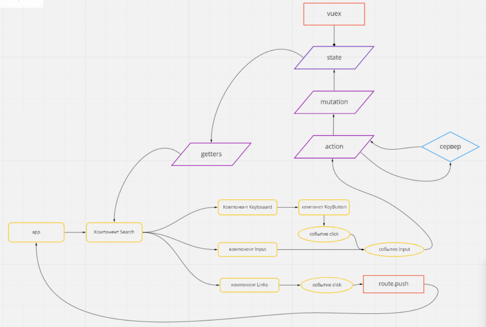

####1) Структура шаблонов компонента:

    | Search.vue
        | Keyboard.vue
            | KeyButton.vue
        | Links.vue
	
##### Логика работы компонентов:

####2) Поисковая логика
При наступления события "imput" будет вызываться мутация которая будет искать совпадения в объектах поиска, и мутировать обект для ссыллок из которого уже компонент Links.vue будет циклом выводить ссылки. 

Для поиска совпадений можно реализовать функцию которая будет принимать два аргумента:
 - обект в котором будет осуществляться поиск
 - искомое значение в виде строки
 
 Функция будет разбивать строку на массив из обЪекта сначала по ключу "hybris"
 и спомощью цикла искать совпадения, затем то же самое по ключу "alias" если будет найдено совпадение то будет возвращаться массив с найденными строками.
  Для совпадений так же нужно учесть язык ввода и возвращать значения с учетом транслита.
 

####3) При нажатии на кнопку поиска пользователь будет попадать на страницу полноценного поиска, ему будут выведены результаты поиска в соответствии с запросом

####4) Макет будет разбит на компоненты: 
- главный компонент для поиска Search.vue
- компонент для экранной клавиатуры Keyboard.vue
  - компонент для кнопок клавиатуры KeyButton.vue
- компонент для вывода ссылок-подсказок Links.vue

####5) За логику поиска будет отвечать компонент Search.vue, чтобы обеспечить модульность и многократное использование этого компонента.
